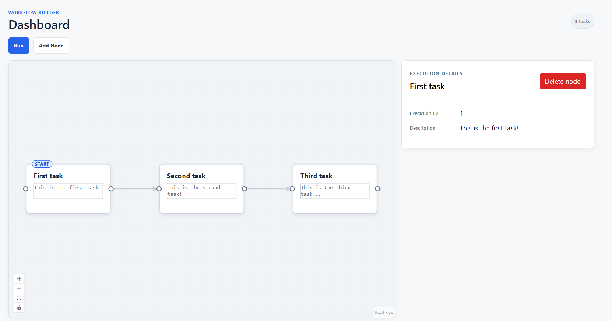
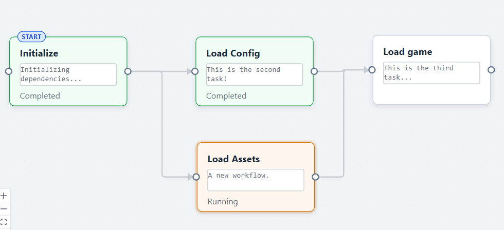
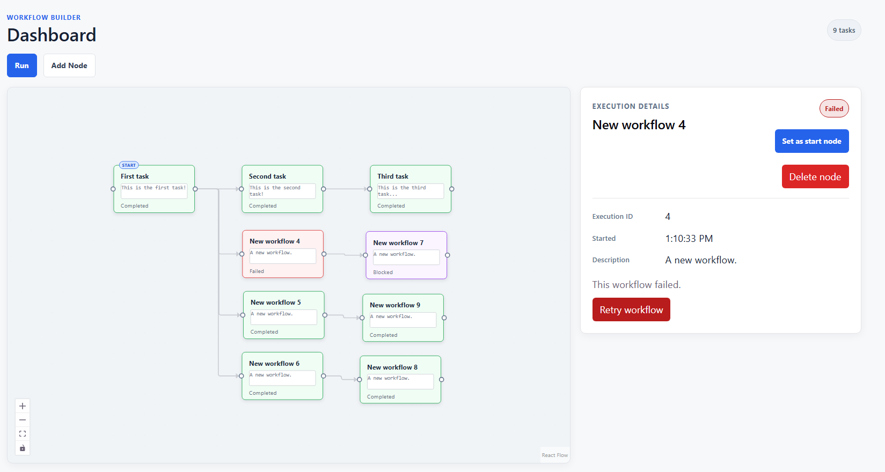

# Workflow Dashboard

[View live demo](https://workflow-mockup.vercel.app/)

A small React and TypeScript workflow editor built with Vite and React Flow. A workflow contains nodes and edges: users can create and connect nodes, choose a start node, edit node details, run the connected workflow, and inspect execution status.

I built this project to strengthen my React and Typescript skills while exploring node-based workflow tools.

## Screenshots

### Dashboard



### Running workflows



### Failed and blocked workflows



## Features

- Left-to-right workflow canvas with draggable nodes and directional edges
- First task selected as the default start node
- Add new nodes to the workflow
- Double-click a selected node title to edit it
- Click a node to select it, then double-click its description to edit it
- Select a node/edge and press `Delete` on keyboard to remove it
- Cycle detection with a temporary error toast
- Simulated workflow execution with running, completed, failed, and blocked states
- Execution metadata shown only after a task has started
- Retry failed nodes
- Responsive graph viewport that refits when its container changes size

## Technologies

- React
- TypeScript
- Vite
- React Flow (`@xyflow/react`)
- ESLint

## Getting Started

Install dependencies:

```bash
npm install
```

Start the development server:

```bash
npm run dev
```

Open the local URL printed by Vite in your browser.

## Scripts

```bash
npm run dev       # Start the Vite development server
npm run build     # Type-check and create a production build
npm run lint      # Run ESLint
npm run preview   # Preview the production build locally
```

## Project Structure

```text
src/
  components/
    NodeDetails.tsx         Selected node details and actions
    StatusBadge.tsx         Execution status badge
    WorkflowCanvas.tsx      React Flow graph and node interactions
    WorkflowToolbar.tsx     Run and add-node actions
  data/
    workflows.ts            Initial workflow definition
  hooks/
    useWorkflowExecution.ts Simulated execution engine
  types/
    workflow.ts             Workflow, node, and edge types
  utils/
    workflowGraph.ts        Graph traversal, ID, and cycle helpers
  App.tsx                   Shared application state and orchestration
```

## Current Limitations

- Workflow execution is simulated
- Workflows are not saved
- No authentication or permissions
- This is just a React Prototype

## Next Steps

- Add automated unit tests
- Add different node types
- Persist workflows through a backend
- Support real-time execution updates
- Workflow history and saved workflows
- UI/UX improvements

## Validation

Run the following before submitting changes:

```bash
npm run lint
npm run build
```
